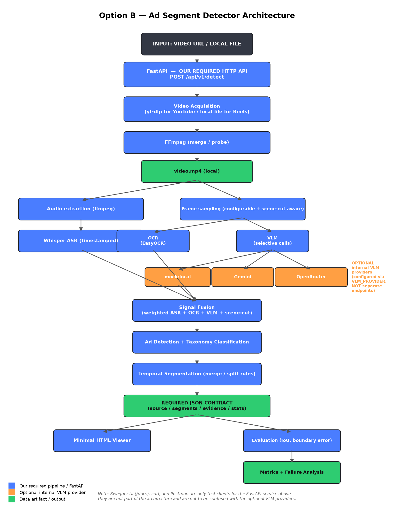

# Ad Segment Detector — Option B

Given a video URL (or local file), returns a machine-readable timeline of
advertising segments: what type of ad, when it starts/ends, confidence,
brand guess, description, and the evidence (frames/transcript) behind it.

Built for the Inclusive Minds AI Engineer screening, Option B track.

## Architecture



FastAPI is **our required HTTP API**. Gemini/OpenRouter are optional
internal AI providers the pipeline can call for the vision step, configured
via `VLM_PROVIDER` — they are not separate endpoints and are not the API
being graded. Swagger/curl/Postman are just clients for testing our API.

## Prerequisites (Windows)

- **Python 3.12.x** (tested with 3.12.10). Do not use 3.11 or 3.13.
- **FFmpeg** on PATH. Download a build from https://www.gyan.dev/ffmpeg/builds/,
  extract it, and add the `bin` folder to your PATH. Verify with:
  ```
  ffmpeg -version
  ffprobe -version
  ```
- **yt-dlp** (installed via requirements.txt, but the binary must also work —
  `pip install yt-dlp` gives you both the Python package and the `yt-dlp` CLI).
- Optional: a Gemini or OpenRouter API key if you want real VLM detection
  instead of the free zero-cost mock provider.

## Setup (Windows CMD or PowerShell)

```cmd
cd ad-segment-detector
python -m venv .venv
.venv\Scripts\activate
python -m pip install --upgrade pip
python -m pip install -r requirements.txt
copy .env.example .env
```

`easyocr` pulls in `torch`/`torchvision` transitively — the first install
can take a while and several GB of disk. If you want a faster smoke test
first, edit `.env` and set `OCR_PROVIDER=null` to skip OCR while you verify
everything else works, then switch it back.

## Running the API

```cmd
.venv\Scripts\activate
uvicorn src.main:app --reload --host 0.0.0.0 --port 8000
```

- Swagger UI: http://localhost:8000/docs
- Health check: http://localhost:8000/health
- Viewer: http://localhost:8000/viewer/

### curl example

```cmd
curl -X POST http://localhost:8000/api/v1/detect ^
  -H "Content-Type: application/json" ^
  -d "{\"url\": \"https://www.youtube.com/watch?v=ujFWRFYLGjY\"}"
```

### Postman

Import as a raw POST request to `http://localhost:8000/api/v1/detect` with
body (raw JSON):
```json
{ "url": "https://www.youtube.com/watch?v=ujFWRFYLGjY" }
```
Postman is only a test client here — it does not run any code itself.

## Running the pipeline from the command line

Useful for the five-video evaluation, since it writes output straight to a
file without needing the server running:

```cmd
.venv\Scripts\activate
python scripts\run_pipeline.py "https://www.youtube.com/watch?v=ujFWRFYLGjY" --out artifacts\video1_longform_youtube.json
python scripts\run_pipeline.py "https://www.youtube.com/shorts/Ve0zdhTQA4U" --out artifacts\video2_youtube_short.json --kind short
python scripts\run_pipeline.py "C:\path\to\downloaded_reel1.mp4" --out artifacts\video4_instagram_reel_1.json --kind short
```

For the Instagram Reels: per the assignment, acquisition is manual. Screen-
record or otherwise save the Reel locally, then pass the local file path.

For the live stream: if it's online, pass the URL directly (optionally with
`--live-max-seconds 1200` to bound the capture for testing). If it's
offline when you run, record 20+ minutes of the same channel yourself and
pass that file, noting this substitution in `EVAL.md` as the brief requires.

## Ground truth and evaluation

1. Watch the five official test videos yourself.
2. Copy `ground_truth/ground_truth.template.json` to
   `ground_truth/ground_truth.json` and fill in your own labels — see
   `ground_truth/README.md`. This is not automated and should not be.
3. Run the pipeline against each video (above), saving to `artifacts/<video_id>.json`.
4. Run:
   ```cmd
   python scripts\run_evaluation.py
   ```
   This prints precision/recall/F1/IoU/boundary-error per video, and reports
   any video as `PENDING` if you haven't produced ground truth or a
   prediction for it yet — it never fabricates numbers.

## Running tests

```cmd
.venv\Scripts\activate
python -m pytest tests\ -v
```

All 27 tests are self-contained (mocked external calls) and require no
network access, no API keys, and no real video downloads.

## Sample output shape

```json
{
  "source": { "url": "...", "platform": "youtube", "kind": "vod", "duration_s": 812.4, "processed_at": "..." },
  "segments": [
    {
      "id": "seg_01", "start_s": 124.0, "end_s": 187.5,
      "ad_type": "midroll_sponsor_read", "confidence": 0.81, "brand": "Acme VPN",
      "description": "...",
      "evidence": { "frame_timestamps": [125.0, 140.5], "transcript_span": "...", "signals_used": ["asr", "vlm_frame"] }
    }
  ],
  "stats": { "wall_clock_s": 47.2, "estimated_cost_usd": 0.083, "frames_sampled": 214, "model_calls": 19 }
}
```

## Configuration

All tunables are in `.env` (see `.env.example` for the full list with
comments): frame sampling intervals, detection thresholds, merge/split
gaps, VLM provider/model/cost caps, ASR model size, etc. Nothing is
hard-coded in the detection logic itself.

## Troubleshooting

| Symptom | Likely cause / fix |
|---|---|
| `yt-dlp is not installed` | `pip install yt-dlp`; confirm `yt-dlp --version` works in the same shell |
| `Required binary 'ffmpeg' was not found on PATH` | Install FFmpeg and add its `bin` folder to PATH, or set `FFMPEG_PATH`/`FFPROBE_PATH` in `.env` to the full exe path |
| `No supported JavaScript runtime could be found` (yt-dlp warning) | Non-fatal — yt-dlp still extracts formats. Only relevant if a specific extraction genuinely needs it; do not attempt to bypass |
| EasyOCR install is huge / slow | Set `OCR_PROVIDER=null` in `.env` to skip OCR temporarily |
| VLM calls fail with "requires VLM_API_KEY" | Set `VLM_PROVIDER=mock` in `.env`, or supply a real key for `gemini`/`openrouter` |
| Download times out on a live stream | Pass `--live-max-seconds` to `run_pipeline.py`, or increase `DOWNLOAD_TIMEOUT` in `.env` |

## Limitations (honest, as of this submission)

- The mock VLM provider is a zero-cost scaffold, not a real detector — real
  detection quality depends on wiring up Gemini or OpenRouter with a key.
- Live-stream support here is Tier 2 scope: windowed processing exists in
  design (see DESIGN.md) but has not been run against a genuinely live
  URL from this environment; validate it yourself before relying on it.
- Instagram acquisition is intentionally manual per the brief — there is no
  automated Reels scraper here, by design, not by oversight.
- Ground truth and the eight ambiguity-pack rulings are yours to complete —
  see `ground_truth/README.md` and the `REVIEW` markers in `DESIGN.md` and
  `src/detection/classifier.py`.
